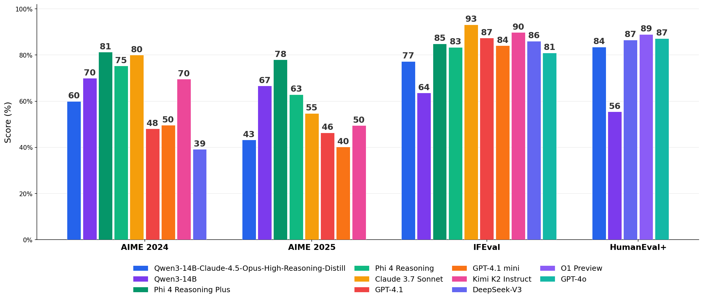

# Effects of Distilling Claude 4.5 Opus into Qwen3-14B

> **Note:** I did not create and do not endorse the distilled model, I just thought it would be interesting to do some research on it.

## Results

| Benchmark | Distilled | Base Qwen3-14B | Significant? |
|---|---|---|---|
| HumanEval+ (coding) | **83.5%** | 55.5% | **very significant**: p < 10^-9 (***) |
| IFEval (instruction following) | **77.3%** | 63.6% | **very significant**: p < 10^-7 (***) |
| AIME 2024 (competition math) | 56.7% | **70.0%** | not significant: p = 0.344 (ns) |
| AIME 2025 (competition math) | 43.3% | **66.7%** | **significant**: p = 0.039 (*) |

The distilled model is significantly better at coding and instruction following, but worse at math. On HumanEval+, the distilled model solved 49 extra problems the base couldn't while only losing 3, a 16:1 ratio. On AIME (combined), the base model solved 41/60 vs 30/60 for the distilled model.

## The Why

The distillation transferred "how to think," not domain-specific knowledge with near-zero overlap between training prompts and benchmark problems (simple arithmetic and high-level project descriptions vs. competition math and precise function signatures), the model had to generalize the reasoning style itself.

Improvement was uniform across skill types regardless of how many training examples covered each skill (Spearman rho ~ 0). The base Qwen3-14B reasons 3x longer on math problems (37K-44K chars vs 1K-14K), and the distilled model's compressed reasoning chains are insufficient for competition-level math. The training data's simple arithmetic taught the model not to think hard about math, just long enough to answer simple problems, which backfired on AIME.

## Comparison With Other Models

### Models

- Distilled: `TeichAI/Qwen3-14B-Claude-4.5-Opus-High-Reasoning-Distill-GGUF`
- Base: `Qwen/Qwen3-14B-GGUF`
- Dataset: `TeichAI/claude-4.5-opus-high-reasoning-250x` (250 examples/2 million tokens from Claude 4.5 Opus)
